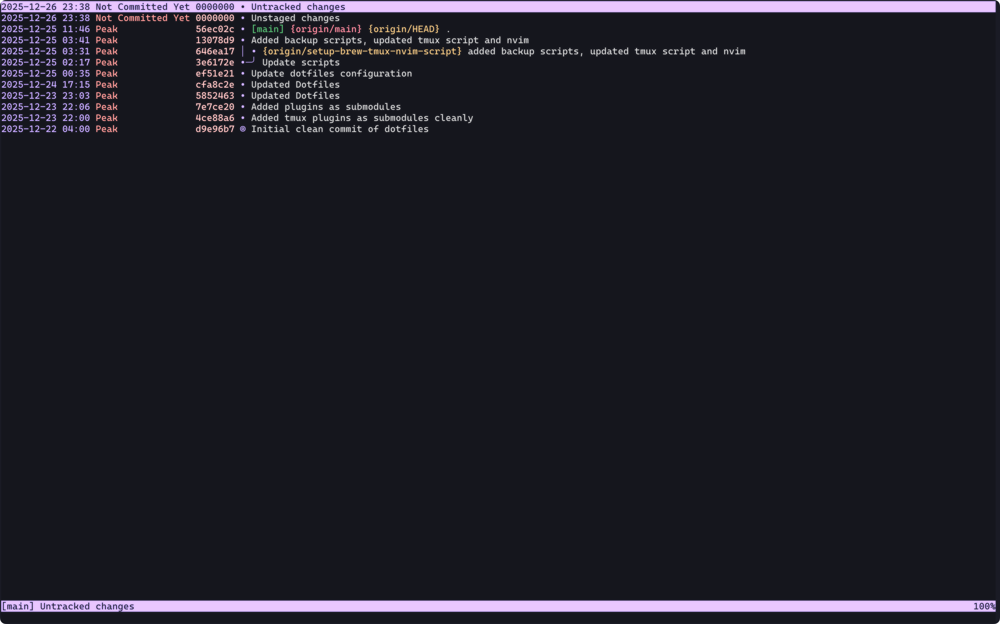
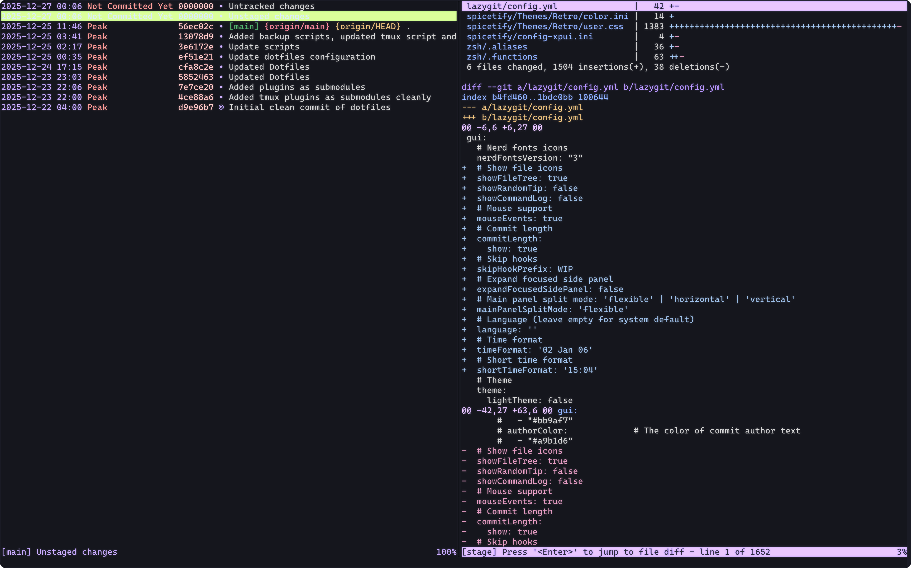
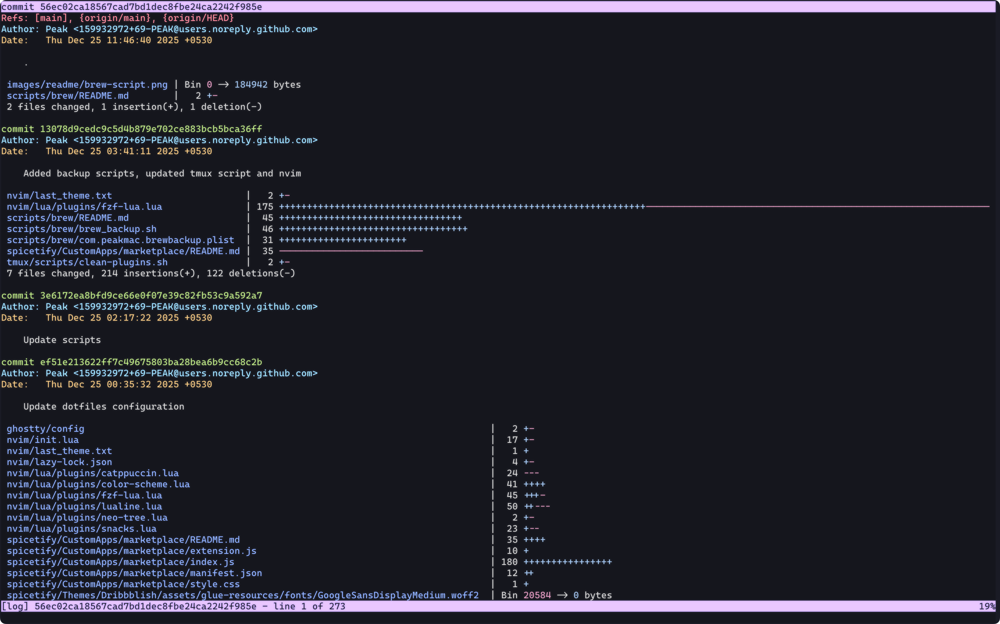
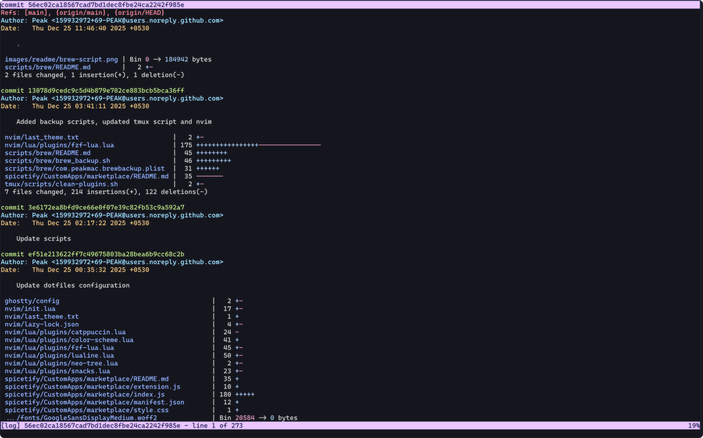
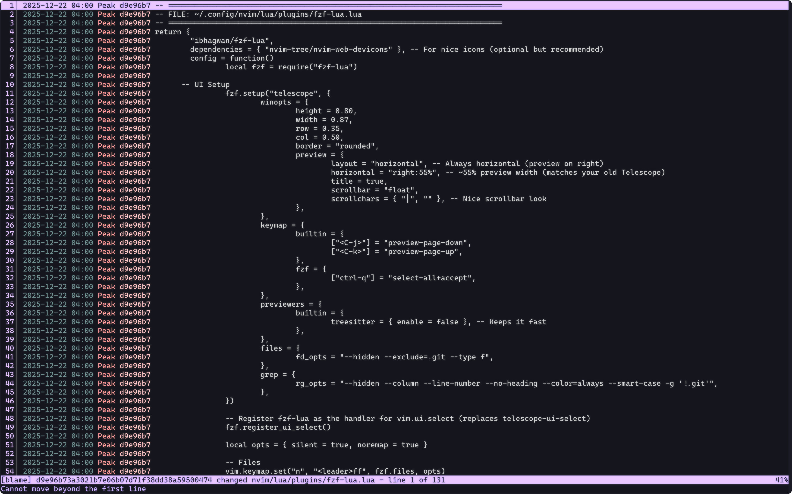
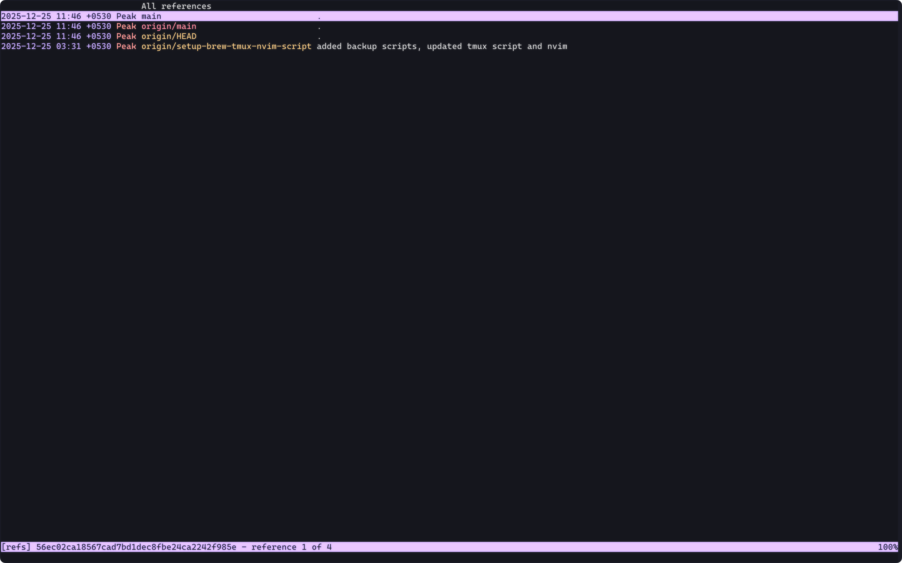
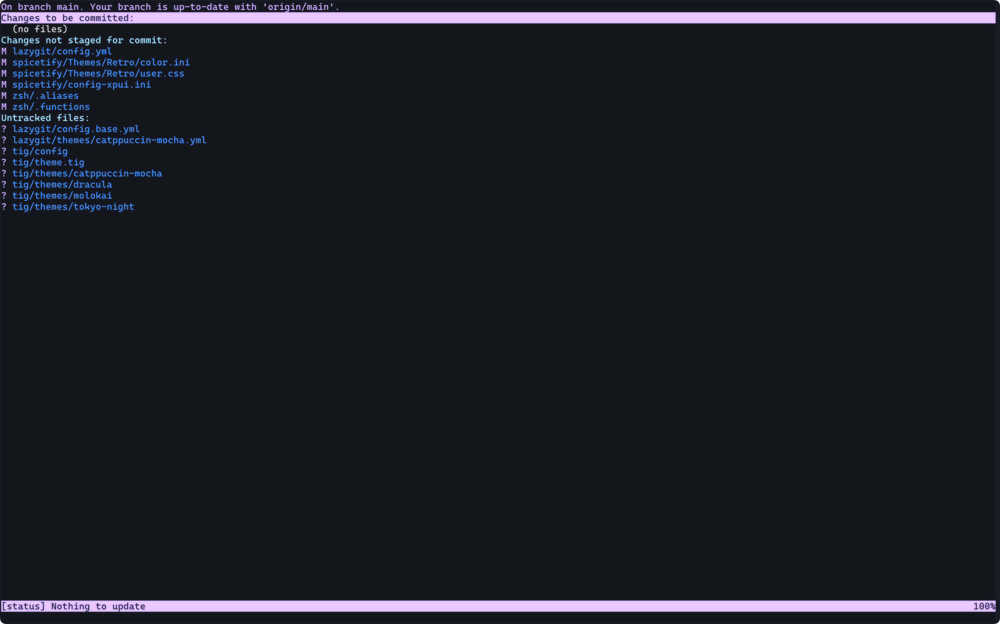
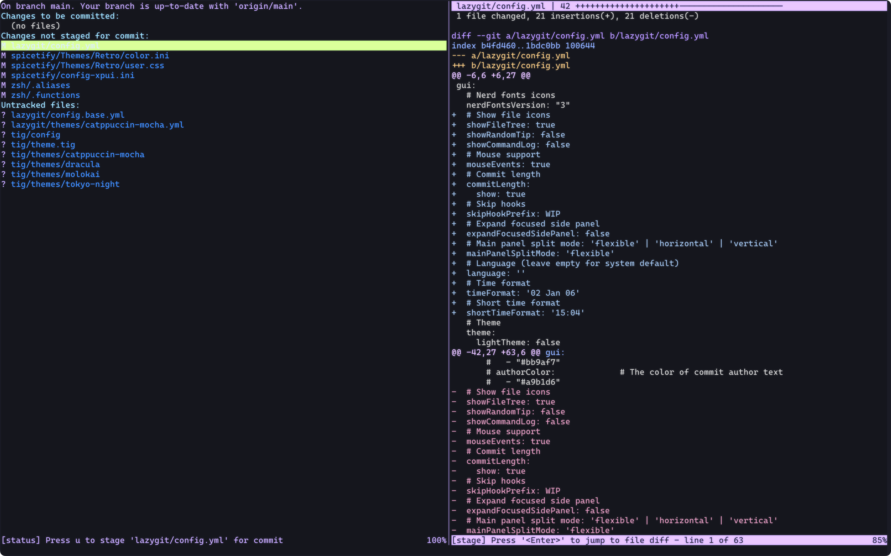
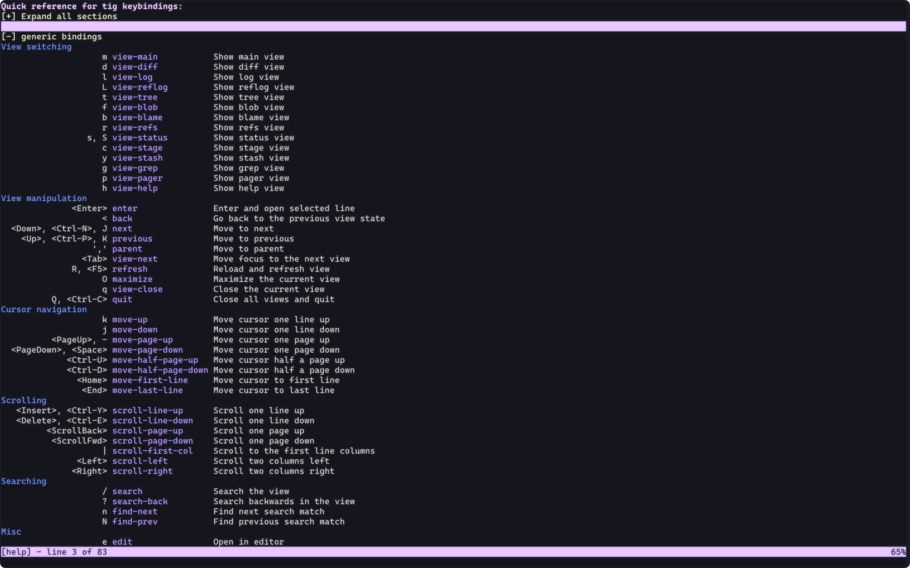

<p align="center">
  
</p>
<p align="center">
  
  
  
  
</p>

<h1 align="center">Catppuccin-Like colorscheme for Tig</h1>

<p align="left">
  This is a <a href="https://github.com/catppuccin/catppuccin">Catppuccin</a> inspired colorscheme for <a href="https://github.com/jonas/tig">tig</a>.
</p>

## **Preview**

### Main View




### Diff View



### Log View



### Blame View



### Reference View



### Status View



### Stage View



### Help View



## **Prerequisites**

- [Git](https://github.com/git/git)
- [Tig: Text-mode interface for Git](https://github.com/jonas/tig)
- 256-color scheme Terminal

## **Installation**

### 1. Install Git

Git is required for both tig and cloning this repository.

- macOS (Homebrew)

```bash
brew install git
```

- Linux
  - Arch Linux

  ```bash
   sudo pacman -S git
  ```

  - Debian/Ubuntu

  ```bash
   sudo apt install git
  ```

- Windows
  Download and install Git for Windows from the official website:
  https://git-scm.com/download/win

Ensure Git is available:

```bash
git --version
```

### 2. Install Tig

- macOS (Homebrew)

```bash
brew install tig
```

- Linux
  - Arch Linux

  ```bash
   sudo pacman -S tig
  ```

  - Debian / Ubuntu

  ```bash
   sudo apt install tig
  ```

- Windows

```bash
winget install jonas.tig
```

Ensure tig is available:

```bash
tig --version
```

## **3. Install the Catppuccin Theme**

**Option 1: Without tig-theme function.**

If you do not use the tig-theme function, you can load the theme directly from your tig config.

1. Clone this repository:

```bash
git clone https://github.com/69-PEAK/catppuccin-tig.git
```

2. Copy the theme file:

```bash
mkdir -p ~/.config/tig/themes

cp tig-catppuccin/themes/catppuccin ~/.config/tig/
```

3. Add the following line to ~/.config/tig/config:

```bash
source ~/.config/tig/catppuccin
```

4. Restart `tig`.

**Option 2: With tig-theme function.**

If you use the tig-theme function to switch themes dynamically, the theme must be placed inside the themes directory.

1. Create the themes directory:

```bash
mkdir -p ~/.config/tig/themes
```

2. Copy the theme file:

```bash
cp -r tig-catppuccin/themes/catppuccin ~/.config/tig/themes/
```

3. Apply the theme:

```bash
tig-theme catppuccin
```

4. Restart `tig`.

---

> [!IMPORTANT]
>
> The tig-theme function must be defined in your ~/.zshrc (or equivalent shell config) and sourced before use.
> Add the function to your ~/.zshrc, then reload your shell:
>
> ```bash
> source ~/.zshrc
> ```
>
> Terminal must support true color, e.g., Ghostty, Kitty or Alacritty.

## **Directory Structure**

Here’s a quick look at what your directory layout should look like.

```
tig
├── config
└── themes
    └── catppuccin
```
